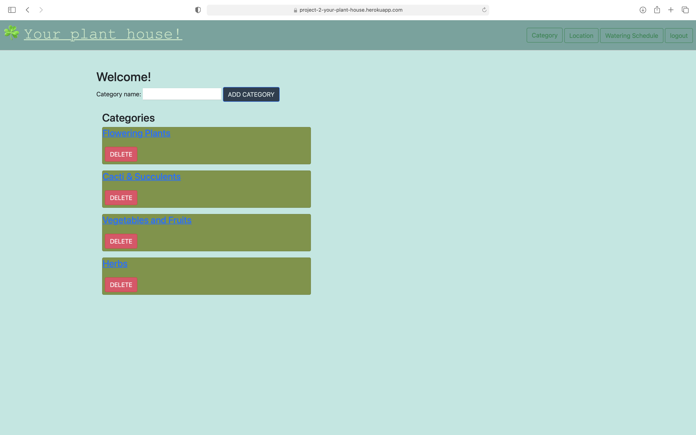
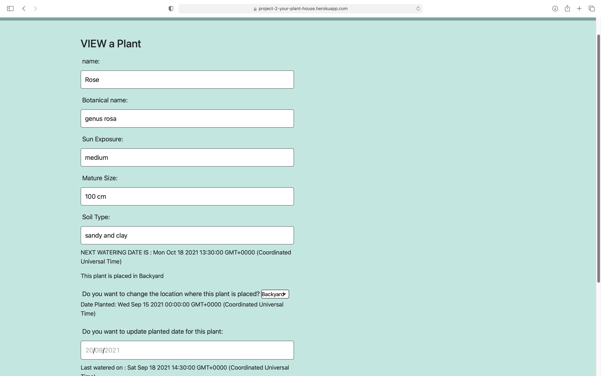
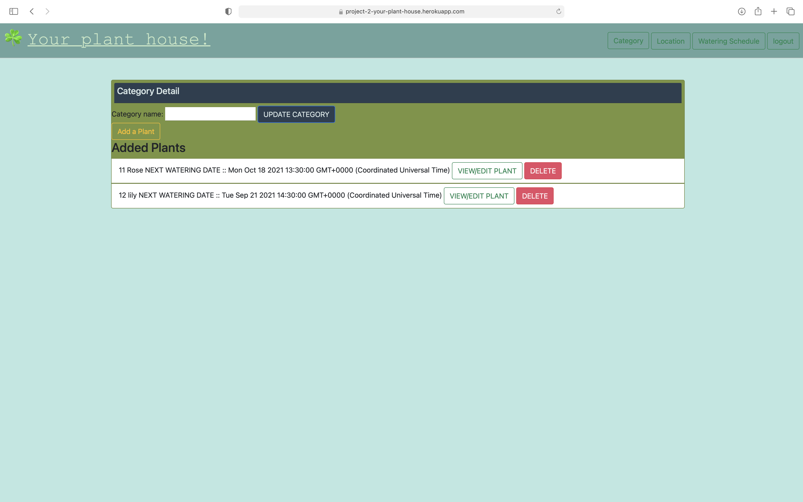
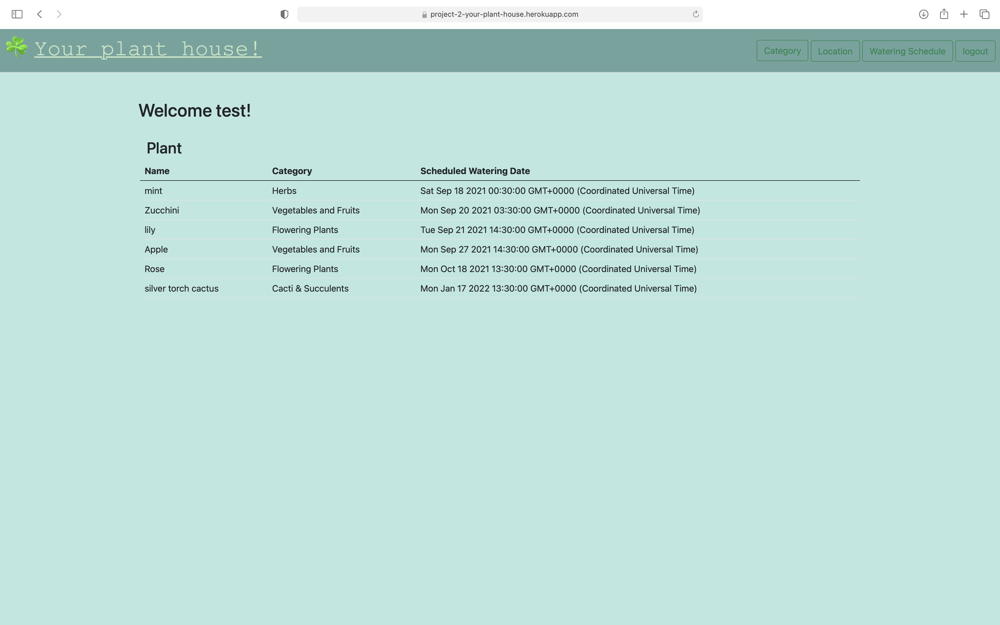

# Project:- full-stack web application : Your Plant House!

This full-stack application allow user to plan his/her plant house using all the features. By using our application user can add his plant details such categories of plant, plant name, Botanic name, sun exposure, watering frequency, planting date and other details. User can get the notification about
what should be done at what time to make plants healthier. User also can update and delete their plants from their profile

## Our Task
 
Our group decided to make a project on plant planer. This application will allow user to login on their profile and access all previously added plants.
User can view different pages such as categories, view added plant, update plants. User can store multiple plant details as per their plan.

### User Story

AS A user 

I WANT to make plan for my plants by using one single application which store all my current and previous data.
SO THAT I can take care of my plants carefully with all necessary steps to nurture.

## Acceptance Criteria

GIVEN a full-stake application with form inputs 

### Home page:

WHEN I open my planner 
THEN I am able to sign up for my plant planer
WHEN I open it I can 

### Sign up form :  

WHEN I go to sign up page
THEN I can crete my profile with using my details
WHEN I click on name placeholder 
THEN I can add my name on it
WHEN I click on email placeholder
THEN I am able to add my email address
WHEN I click on password placeholder
THEN I am able to create password for my account
WHEN I click on submit button
THEN my profile could be  generated

### Form 2 : Log in form :

WHEN I go to login page
THEN I can log in in my account
WHEN I click on email placeholder
THEN I am able to add my email address
WHEN I click on password placeholder
THEN I am able to type password for my account
WHEN I click on submit button
THEN I am able to access my profile dashboard

### User dashboard :
WHEN I go to my user dashboard
THEN I am able to see my categories 
WHEN I click on view category 
THEN I am able to see the category details
WHEN I click on add category button
THEN I am able to see all adding details in the other page
WHEN I delete category 
THEN I am able to delete the particular category
WHEN I click on category 
THEN I can redirect to plants page of that category.

### Add Plant form :

WHEN I click on plant form 
THEN I am able to add plant name
I am also able to add botanical name
I am also able to add Sun Exposure
I am also able to add mature size of the plant
I am also able to add type of soil that required for the plant
I am also able to add date planted and purchased from date selection
I am also able to add location such as garden, bedroom etc
I am also able to add watering frequency
I am also able to add watering frequency interval
WHEN I click on the submit button
THEN I am able to save my plant details

### VIEW AND UPDATE Plant form :

WHEN I click on view update button
THEN I AM able to redirect to update form
WHERE I can view my plants details and update them as per requirement.

### Screenshots

### Video Link
https://drive.google.com/file/d/1lIwF6WTNdSOzSln2HvEYYPYKxCa4AqmN/view?usp=sharing

### Heroku Link
https://project-2-your-plant-house.herokuapp.com

### Github Link
https://github.com/Adeamer/Your-Plant-House

For commit history please see the original repo: https://github.com/Adeamer/Project-2 
The code in this repo is broken as we faced alot of issues pushing the code to the main branch. We would get alot of conflicts but weren't able to resolve them in Git-Hib.
So we add the your-plant-house repo to get the app working.

